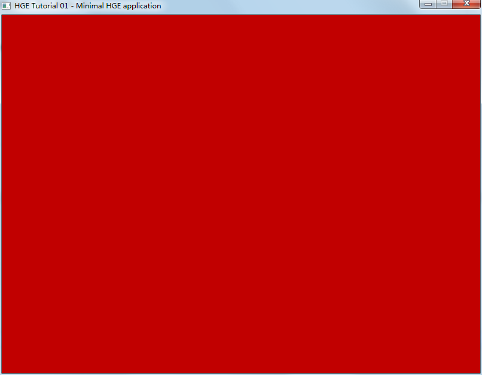

# Node.js HGE Demo

A minimum verifiably HGE demo for Node.js.

## Build

Ensure you're using Windows and do have Node.js (MUST BE **x86**) and Visual Studio.

```shell
$ npm install
```

## Execute

```shell
$ node example/test.js
```

And you will see:

